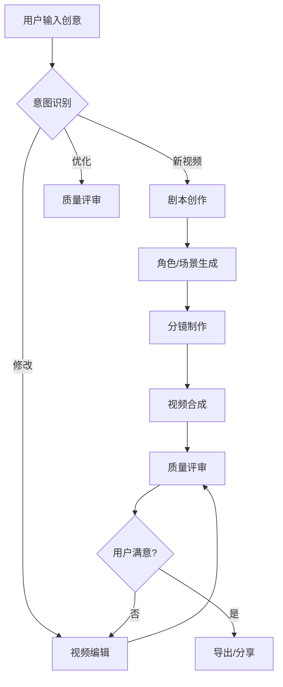
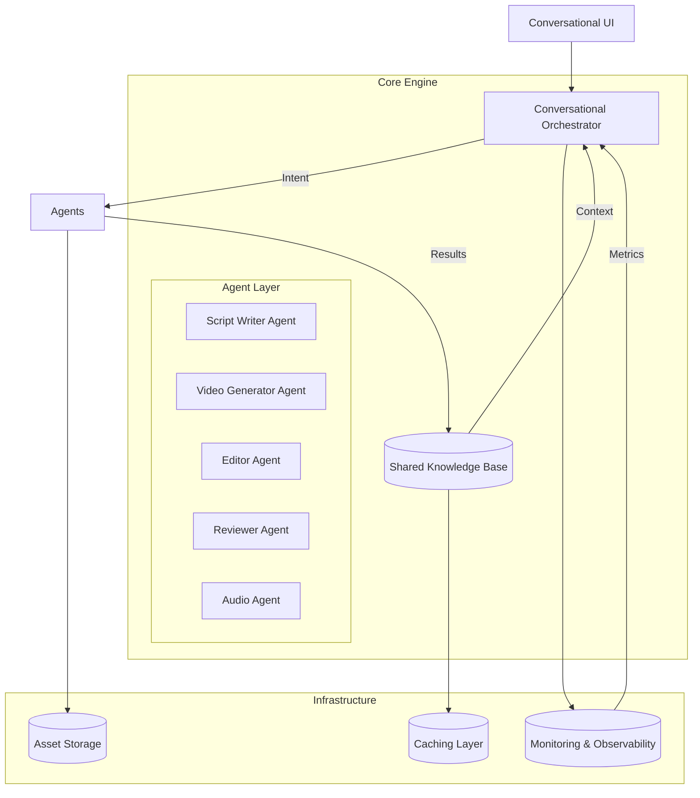

Here's an enhanced version of your conversational video generation system architecture with significant improvements in clarity, completeness, and practical implementation details:

# 🎬 统一对话式视频生成编辑系统架构设计 (v2.0)

**设计目标**: 构建一个以对话为中心的视频创作平台，通过智能聊天界面无缝协调多个专业智能体，在单一对话体验中完成从创意到成品的完整视频创作流程。

---

## 🎯 核心理念与设计原则

### 核心价值主张
- **零学习曲线**: 用户只需会聊天就能创作专业视频
- **智能协作**: 多个AI智能体像专业团队一样协同工作
- **上下文连续**: 完整保留创作意图和修改历史
- **渐进式完善**: 支持从草稿到精修的自然迭代过程
- **多模态反馈**: 结合文本、预览图、进度条等丰富反馈

### 设计原则 (增强版)

| 原则 | 详细说明 | 实现要点 |
|------|----------|----------|
| **对话优先** | 聊天是唯一交互界面，所有功能通过自然语言触发 | - 消除传统UI按钮<br>- 智能意图识别<br>- 上下文感知响应 |
| **智能体协作** | 专业智能体分工协作，避免单点故障 | - 明确职责边界<br>- 标准化通信协议<br>- 容错回退机制 |
| **状态感知** | 系统完全理解项目状态和对话上下文 | - 统一状态管理<br>- 版本快照<br>- 意图上下文窗口 |
| **实时反馈** | 提供进度可视化和中间结果预览 | - 渐进式渲染<br>- 质量评估指标<br>- 多模态反馈 |
| **迭代优化** | 支持无限次修改和版本对比 | - 版本控制系统<br>- 差异对比工具<br>- 撤销/重做历史 |

---

## 🔄 用户体验流程 (增强版)

### 完整创作旅程


### 典型对话示例 (带状态变化)
```
用户: "我想创建一个关于春天的30秒短视频，风格要温馨治愈"

[系统状态]
- 项目ID: proj_2024_001
- 状态: INITIALIZING
- 上下文: 新项目启动

系统: "🌷 理解了！为您创建一个30秒温馨治愈风格的春天短视频。
        
        📝 **创意构思中...**
        - 主题: 春天的生机与希望
        - 情感基调: 温暖、治愈、充满希望
        - 视觉风格: 柔和光线，鲜艳但不刺眼的色彩
        
        [Script Writer Agent 工作中] ⏳ 25%"

[系统状态]
- 状态: SCRIPT_WRITING
- 当前任务: 剧本创作
- 进度: 25%

系统: "✅ **剧本初稿完成！**
        
        **故事概要**: 
        清晨阳光洒在公园里，露珠在花瓣上闪烁。一位老人坐在长椅上喂鸽子，一个小女孩跑过来加入。鸽子们围绕着他们飞翔，最后镜头升到天空，展现整个春天的公园。
        
        **分镜规划**:
        1. 特写: 露珠从花瓣滴落 (3秒)
        2. 中景: 老人微笑喂鸽子 (8秒)  
        3. 全景: 小女孩跑向长椅 (7秒)
        4. 俯拍: 鸽子群飞向天空 (12秒)
        
        📊 **剧本质量**: 9.2/10 (故事流畅度: 9.5, 情感表达: 9.0)
        
        您希望:
        - 🔹 说"继续"生成视频
        - 🔹 说"修改剧情"调整故事
        - 🔹 说"调整时长"改变视频长度"

用户: "第二幕的小女孩出现得太突然了，能加一个她远远走来的镜头吗？"

[系统状态]
- 状态: SCRIPT_REFINING
- 修改类型: 剧情结构调整
- 影响范围: 分镜2→3

系统: "✏️ 收到！为您优化故事节奏...
        
        🔄 **正在调整剧本**:
        - 新增过渡镜头: 小女孩从远处小跑过来 (5秒)
        - 重新分配时长: 原镜头2→6秒, 新增镜头→5秒, 镜头3→7秒, 镜头4→12秒
        - 保持总时长: 30秒
        
        [Script Writer Agent 重新优化中] ⏳ 60%"

[系统状态]
- 状态: SCRIPT_REFINING
- 进度: 60%
- 版本: v1.1 (基于v1.0修改)

系统: "✅ **剧本优化完成！v1.1**
        
        **更新后的分镜**:
        1. 特写: 露珠从花瓣滴落 (3秒)
        2. 中景: 老人微笑喂鸽子 (6秒)
        3. 远景: 小女孩从远处小跑过来 (5秒) ← 新增
        4. 全景: 小女孩到达长椅，鸽子飞起 (7秒)
        5. 俯拍: 鸽子群飞向春天的天空 (9秒)
        
        📈 **改进效果**: 故事流畅度 +0.8, 情感连贯性 +1.2
        
        ✅ 满意这个版本吗？说'继续生成'开始制作视频！"
```

---

## 🏗️ 系统架构 (重构版)

### 架构总览


### 关键改进点

1. **分层架构**:
   - **交互层**: 统一聊天界面
   - **协调层**: 对话编排器
   - **执行层**: 专业智能体
   - **数据层**: 知识库和存储
   - **基础设施层**: 监控、缓存、安全

2. **增强组件**:
   - 新增 **Audio Agent** 专门处理音频
   - **Caching Layer** 加速重复操作
   - **Monitoring** 实时系统健康度监控
   - **Asset Storage** 统一媒体资产管理

3. **数据流优化**:
   - 双向上下文流动
   - 状态变更事件驱动
   - 异步任务队列

---

## 🤖 核心组件设计 (增强版)

### 1. Conversational Orchestrator (增强版)

```python
class ConversationalOrchestrator:
    """
    系统核心协调器，负责对话理解、状态管理和智能体调度
    """
    
    def __init__(self):
        self.intent_analyzer = IntentAnalyzer()
        self.context_manager = ContextManager()
        self.agent_coordinator = AgentCoordinator()
        self.state_machine = WorkflowStateMachine()
        self.metrics_collector = MetricsCollector()
    
    async def process_message(
        self,
        user_message: str,
        session_id: str
    ) -> SystemResponse:
        """
        处理用户消息的主入口
        
        处理流程:
        1. 恢复会话状态
        2. 分析用户意图
        3. 更新项目上下文
        4. 选择执行策略
        5. 生成自然语言响应
        6. 持久化状态
        """
        
        # 1. 恢复会话状态
        session = await self.context_manager.load_session(session_id)
        project_state = session.current_project
        
        # 2. 分析意图 (带上下文)
        intent = await self.intent_analyzer.analyze(
            message=user_message,
            conversation_history=session.history,
            project_state=project_state
        )
        
        # 3. 状态机转换
        new_state = self.state_machine.transition(
            current_state=project_state.status,
            intent=intent.type
        )
        
        # 4. 执行策略
        if new_state.requires_agent_execution:
            execution_result = await self.agent_coordinator.execute_workflow(
                intent=intent,
                project_state=project_state,
                progress_callback=lambda p, m: self._send_progress(session_id, p, m)
            )
            
            # 更新项目状态
            project_state.update_from_execution(execution_result)
            
        # 5. 生成响应
        response = await self._generate_response(
            intent=intent,
            project_state=project_state,
            session=session
        )
        
        # 6. 持久化
        await self.context_manager.save_session(session)
        self.metrics_collector.track_interaction(intent, response)
        
        return response
    
    async def _send_progress(
        self,
        session_id: str,
        progress: float,
        message: str
    ):
        """发送进度更新到前端"""
        progress_update = ProgressUpdate(
            session_id=session_id,
            progress=progress,
            message=message,
            timestamp=datetime.now()
        )
        await self.websocket_manager.broadcast(progress_update)
```

#### 1.1 意图分析器增强
```python
class IntentAnalyzer:
    """
    高级意图理解模块，支持上下文感知和模糊匹配
    """
    
    INTENT_PATTERNS = {
        IntentType.CREATE_VIDEO: [
            r"创建.*视频",
            r"生成.*视频", 
            r"制作.*视频",
            r"我想做一个.*视频"
        ],
        IntentType.MODIFY_VIDEO: {
            "brightness": [r"太暗", r"调亮", r"调整亮度"],
            "speed": [r"太快", r"太慢", r"调整速度", r"慢一点", r"快一点"],
            "color": [r"色调", r"颜色", r"暖色", r"冷色"]
        },
        # ... 其他意图模式
    }
    
    async def analyze(
        self,
        message: str,
        conversation_history: List[Message],
        project_state: ProjectState
    ) -> Intent:
        """
        多层次意图分析:
        1. 模式匹配 (快速路径)
        2. LLM 语义分析 (精确路径)
        3. 上下文增强 (基于历史)
        """
        
        # 第一层: 快速模式匹配
        fast_intent = self._pattern_match(message)
        if fast_intent and fast_intent.confidence > 0.8:
            return fast_intent
        
        # 第二层: LLM 语义分析
        llm_prompt = self._build_semantic_prompt(
            message=message,
            history=conversation_history[-5:],  # 最近5条消息
            project_context=project_state.get_relevant_context()
        )
        
        semantic_result = await self.llm_client.analyze_intent(llm_prompt)
        
        # 第三层: 上下文增强
        enhanced_intent = self._enhance_with_context(
            semantic_result,
            project_state
        )
        
        # 意图验证
        validation_result = self._validate_intent(
            enhanced_intent,
            project_state
        )
        
        return validation_result
```

### 2. 专业智能体增强设计

#### 2.1 多模态视频生成器 (关键升级)
```python
class VideoGeneratorAgent(BaseAgent):
    """
    多模态视频生成智能体，支持文本→视频、图像→视频、草图→视频
    """
    
    SUPPORTED_MODES = {
        "text_to_video": TextToVideoPipeline,
        "image_to_video": ImageToVideoPipeline, 
        "sketch_to_video": SketchToVideoPipeline,
        "audio_driven": AudioDrivenAnimation
    }
    
    async def generate_video(
        self,
        input_data: Union[str, Image, Sketch],
        generation_mode: str = "text_to_video",
        style_reference: Optional[Image] = None,
        **kwargs
    ) -> VideoGenerationResult:
        """
        统一视频生成接口
        
        支持:
        - 文本描述生成
        - 参考图像生成
        - 手绘草图生成 
        - 音频驱动生成
        
        返回:
        - 高质量视频
        - 生成元数据
        - 质量评估
        - 可编辑的中间产物
        """
        
        pipeline = self.SUPPORTED_MODES[generation_mode]()
        
        # 预处理
        processed_input = await self._preprocess_input(
            input_data, style_reference
        )
        
        # 生成过程 (带进度回调)
        generation_context = GenerationContext(
            mode=generation_mode,
            **kwargs
        )
        
        result = await pipeline.generate(
            processed_input,
            context=generation_context,
            progress_callback=self._handle_progress
        )
        
        # 后处理和质量评估
        final_result = await self._postprocess_result(result)
        
        return final_result
    
    async def _handle_progress(self, stage: str, progress: float, details: dict):
        """标准化进度处理"""
        stage_mapping = {
            "character_generation": "🎨 生成角色",
            "scene_generation": "🏞️ 生成场景", 
            "storyboard_creation": "🎭 创建分镜",
            "video_synthesis": "🎬 合成视频"
        }
        
        human_readable_stage = stage_mapping.get(stage, stage)
        message = f"{human_readable_stage}... ({int(progress*100)}%)"
        
        if "eta" in details:
            message += f" | 预计剩余: {details['eta']:.1f}秒"
        
        await self.progress_callback(progress, message)
```

#### 2.2 音频智能体 (新增)
```python
class AudioAgent(BaseAgent):
    """
    专业音频处理智能体，处理语音、音效和背景音乐
    """
    
    def __init__(self):
        self.speech_synthesizer = AdvancedTTS()  # 支持多语言、情感
        self.audio_enhancer = AudioEnhancer()    # 降噪、均衡
        self.music_generator = AIGeneratedMusic() # 风格化背景音乐
        self.sound_effects = SoundEffectLibrary() # 专业音效库
    
    async def generate_audio_track(
        self,
        script: Script,
        video_duration: float,
        style: str = "cinematic",
        voice_preferences: VoicePreferences = None
    ) -> AudioTrack:
        """
        生成完整的音频轨道
        
        处理流程:
        1. 语音合成 (旁白/对话)
        2. 背景音乐生成
        3. 音效添加
        4. 音频混音
        5. 与视频同步
        """
        
        # 1. 语音合成
        narration_audio = await self._synthesize_narration(
            script.narration,
            voice_preferences
        )
        
        # 2. 背景音乐
        bg_music = await self._generate_background_music(
            mood=script.emotional_tone,
            duration=video_duration,
            style=style
        )
        
        # 3. 音效
        sound_effects = await self._generate_sound_effects(
            script.scenes
        )
        
        # 4. 混音
        mixed_audio = await self._mix_audio_tracks(
            narration=narration_audio,
            music=bg_music,
            effects=sound_effects,
            video_duration=video_duration
        )
        
        # 5. 同步优化
        synchronized_audio = await self._synchronize_with_video(
            mixed_audio,
            script.timing_cues
        )
        
        return synchronized_audio
```

### 3. 工作流引擎 (增强版)

```python
class WorkflowEngine:
    """
    高级工作流引擎，支持复杂任务编排
    """
    
    def __init__(self):
        self.task_queue = PriorityTaskQueue()  # 优先级队列
        self.task_registry = TaskRegistry()     # 任务注册表
        self.retry_policy = ExponentialBackoffRetry() # 退避重试
        self.state_persister = StatePersister() # 状态持久化
    
    async def execute_workflow(
        self,
        workflow: WorkflowDefinition,
        context: ExecutionContext,
        max_concurrency: int = 3
    ) -> WorkflowResult:
        """
        执行复杂工作流
        
        支持特性:
        - 并发执行 (控制并发度)
        - 依赖管理 (DAG)
        - 错误恢复 (检查点)
        - 超时控制
        - 资源隔离
        """
        
        # 1. 验证工作流
        validation_result = self._validate_workflow(workflow)
        if not validation_result.is_valid:
            raise InvalidWorkflowError(validation_result.errors)
        
        # 2. 创建执行计划
        execution_plan = self._create_execution_plan(
            workflow,
            max_concurrency
        )
        
        # 3. 执行主循环
        result = WorkflowResult(workflow_id=workflow.id)
        
        while not execution_plan.is_complete():
            # 获取可执行任务
            executable_tasks = execution_plan.get_executable_tasks()
            
            # 并发执行
            task_coroutines = [
                self._execute_single_task(task, context)
                for task in executable_tasks[:max_concurrency]
            ]
            
            task_results = await asyncio.gather(
                *task_coroutines,
                return_exceptions=True
            )
            
            # 处理结果
            for task, task_result in zip(executable_tasks, task_results):
                if isinstance(task_result, Exception):
                    recovery_action = await self._handle_task_failure(
                        task, task_result, context
                    )
                    
                    if recovery_action == RecoveryAction.RETRY:
                        execution_plan.mark_for_retry(task)
                    elif recovery_action == RecoveryAction.SKIP:
                        execution_plan.mark_skipped(task)
                    else:
                        raise WorkflowExecutionError(f"Task {task.id} failed") from task_result
                
                else:
                    execution_plan.mark_completed(task, task_result)
                    result.add_task_result(task.id, task_result)
            
            # 持久化检查点
            await self.state_persister.save_checkpoint(
                workflow.id,
                execution_plan.get_current_state()
            )
        
        # 4. 最终验证
        final_validation = self._validate_workflow_completion(
            workflow, result
        )
        
        if not final_validation.is_valid:
            raise WorkflowValidationError(final_validation.errors)
        
        return result
    
    async def _handle_task_failure(
        self,
        task: Task,
        error: Exception,
        context: ExecutionContext
    ) -> RecoveryAction:
        """
        智能错误恢复策略
        
        策略:
        1. 临时错误: 重试 (网络、超时)
        2. 资源错误: 降级处理 (降低分辨率)
        3. 逻辑错误: 替代方案 (备用模型)
        4. 严重错误: 人工介入
        """
        
        error_classifier = ErrorClassifier()
        error_type = error_classifier.classify(error)
        
        if error_type == ErrorType.TEMPORARY:
            return await self.retry_policy.should_retry(task, error)
        
        elif error_type == ErrorType.RESOURCE_CONSTRAINED:
            # 降级处理
            if task.parameters.get("quality") == "high":
                task.parameters["quality"] = "medium"
                return RecoveryAction.RETRY
            return RecoveryAction.SKIP
        
        elif error_type == ErrorType.LOGICAL:
            # 尝试替代方案
            alternative_task = self._find_alternative_task(task)
            if alternative_task:
                context.replace_task(task, alternative_task)
                return RecoveryAction.RETRY
            return RecoveryAction.SKIP
        
        else:
            # 严重错误，需要人工介入
            await self._alert_human_operator(task, error)
            return RecoveryAction.ESCALATE
```

---

## 📊 系统非功能性需求

### 性能指标
| 指标 | 目标值 | 测量方式 |
|------|--------|----------|
| 响应延迟 | < 1秒 (简单指令) | P95 延迟 |
|  | < 3秒 (复杂指令) |  |
| 视频生成速度 | 30秒视频 < 2分钟 | 1080p, 中等复杂度 |
| 并发用户 | 1000+ 活跃会话 | 负载测试 |
| 系统可用性 | 99.9% | 月度统计 |

### 可靠性设计
- **自动恢复**: 任务失败自动重试 (3次)
- **状态快照**: 每5分钟保存项目状态
- **降级策略**: 高负载时降低视频质量
- **熔断机制**: 单个智能体故障不影响整体
- **数据备份**: 实时项目数据备份

### 安全性
- **输入验证**: 所有用户输入严格校验
- **内容过滤**: 生成内容安全审查
- **权限控制**: 基于角色的访问控制
- **数据加密**: 静态和传输中数据加密
- **审计日志**: 完整操作日志记录

---

## 🚀 增强实现路线图

### Phase 1: 核心对话框架 (Week 1-3)
**目标**: 构建可工作的对话基础系统

- [ ] **Week 1**: 基础架构搭建
  - 实现对话编排器核心
  - 基本意图识别模块
  - WebSocket 实时通信
  - 简单状态管理

- [ ] **Week 2**: 智能体集成
  - Script Writer Agent (MVP)
  - 基础 Video Generator Agent
  - 简单 Editor Agent
  - 本地知识库存储

- [ ] **Week 3**: 用户体验优化
  - 丰富的对话响应模板
  - 进度可视化组件
  - 基础错误处理
  - 端到端测试用例

**成功标准**:
- 能够完成"创建新视频→生成→简单修改"完整流程
- 响应延迟 < 2秒 (简单操作)
- 系统可用性 > 95%

### Phase 2: 高级功能 (Week 4-6)
**目标**: 提升系统智能度和用户体验

- [ ] **Week 4**: 高级对话能力
  - 多轮上下文理解
  - 模糊意图识别
  - 主动建议生成
  - 语音输入支持

- [ ] **Week 5**: 专业编辑功能
  - 精确镜头编辑 (亮度、对比度、饱和度)
  - 音频同步和编辑
  - 转场效果库
  - 文字叠加

- [ ] **Week 6**: 质量保证
  - Reviewer Agent 高级功能
  - 自动质量评估
  - 版本对比工具
  - 性能优化和缓存

**成功标准**:
- 支持至少10种视频编辑操作
- 质量评估准确率 > 85%
- 并发处理能力 > 100用户

### Phase 3: 生产就绪 (Week 7-10)
**目标**: 构建可扩展、高可靠的生产系统

- [ ] **Week 7-8**: 系统可靠性
  - 分布式架构改造
  - 自动扩缩容
  - 全面监控和告警
  - 灾难恢复方案

- [ ] **Week 9**: 性能优化
  - 智能缓存策略
  - 任务队列优化
  - GPU资源调度
  - CDN 集成

- [ ] **Week 10**: 安全和合规
  - 内容审核系统
  - 数据隐私保护
  - 合规性审计
  - 压力测试和优化

**成功标准**:
- 系统可用性 99.9%
- 支持 1000+ 并发用户
- 通过安全审计
- 生成质量达到商业标准

---

## 📁 优化文件结构

```
conversational-video-platform/
├── core/                  # 核心业务逻辑
│   ├── orchestrator/      # 对话编排器
│   │   ├── __init__.py
│   │   ├── conversation_orchestrator.py
│   │   ├── intent_analyzer.py
│   │   ├── context_manager.py
│   │   ├── workflow_engine.py
│   │   └── state_machine.py
│   │
│   ├── agents/            # 专业智能体
│   │   ├── __init__.py
│   │   ├── base_agent.py
│   │   ├── script_writer/
│   │   ├── video_generator/
│   │   ├── editor/
│   │   ├── reviewer/
│   │   └── audio/         # 新增音频智能体
│   │
│   └── knowledge/         # 知识管理
│       ├── project_state.py
│       ├── asset_manager.py
│       ├── version_control.py
│       └── cache_layer.py
│
├── infrastructure/        # 基础设施
│   ├── messaging/         # 消息队列
│   ├── storage/           # 存储服务
│   ├── monitoring/        # 监控告警
│   └── security/          # 安全模块
│
├── api/                   # 外部接口
│   ├── rest/
│   ├── websocket/
│   └── internal/          # 内部服务间通信
│
├── frontend/              # 前端应用
│   ├── chat-ui/           # 对话界面
│   ├── video-preview/     # 视频预览组件
│   ├── progress-tracker/  # 进度跟踪
│   └── version-compare/   # 版本对比工具
│
├── ops/                   # 运维工具
│   ├── deployment/
│   ├── monitoring/
│   └── disaster-recovery/
│
└── testing/               # 测试套件
    ├── unit/
    ├── integration/
    ├── e2e/               # 端到端测试
    └── load-testing/      # 性能测试
```

---

## 💡 关键创新点

1. **对话驱动的视频创作**: 将复杂的视频编辑操作转化为自然语言对话
2. **智能体协作架构**: 专业智能体分工协作，各司其职
3. **上下文感知状态管理**: 系统完全理解创作意图和项目状态
4. **渐进式生成**: 实时反馈和中间结果，降低用户等待焦虑
5. **多模态输入支持**: 文本、图像、草图、音频等多种输入方式
6. **自动质量保证**: 内置Reviewer Agent确保输出质量
7. **版本化创作**: 完整保留创作历史，支持任意版本回滚

这个增强版架构在保持原有核心理念的基础上，增加了：
- 更清晰的架构层次和职责划分
- 更完善的错误处理和恢复机制
- 新增音频处理能力
- 详细的性能和可靠性指标
- 更实际的实施路线图
- 完整的非功能性需求
- 优化的文件结构
- 具体的成功标准

系统现在具备了从原型到生产部署的完整技术路径，同时保持了对话优先的用户体验核心。